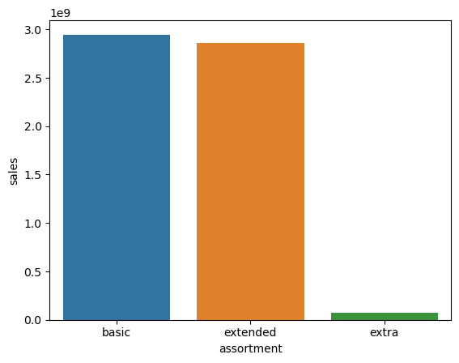
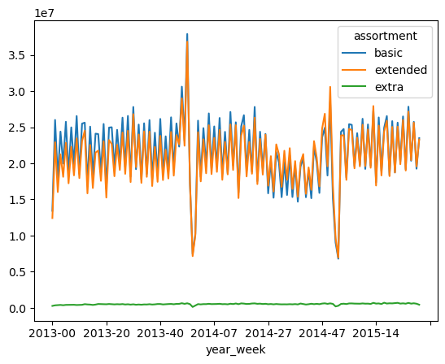
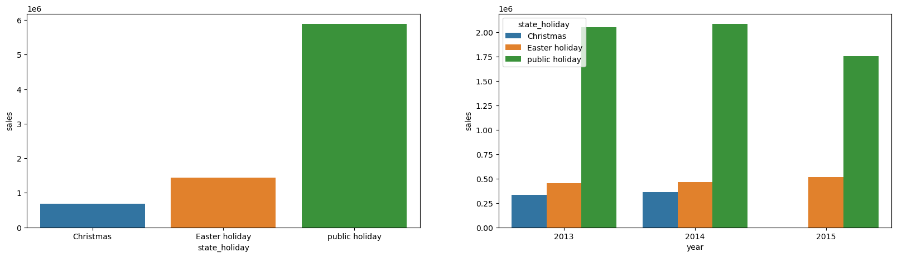
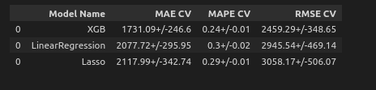
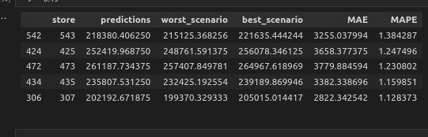

# 1.0 Problema de negócio
 - Previsão de venda diária das próximas seis semanas de todas lojas da Rossmann.
## 1.1 Entendimento do negócio
Em uma das reuniões semanais entre com os gerentes de todas lojas o CFO da empresa solicitou aos gerentes que cada um deles entregue uma previsão de venda diária das próximas seis semanas de cada uma das suas lojas. 

A previsão das vendas ajudará o CFO a definir o orçamento que será disponibilizado para reformas e manutenções para cada uma das lojas.

## 1.2 Solução
 - Previsão das vendas será realizadas através de um modelo de machine learning
 - O acesso as previsões realizadas poderá ser acessado através do celular.

# 2.0 Premissas do projeto

- As vendas são influenciadas pela proximidade dos concorrentes, feriados escolares e estaduais, sazionalidade e localização;
- As vendas são influenciadas pela variadade de produtos na loja;
- As vendas são influenciadas pelas promoções.
- 
# 3.0 Planejamento da solução
O planejamento da solução foi baseada no método CRISP-DS com o intuíto de entregar o projeto de forma rápida e com qualidade.

## 3.1 Descrição dos dados
Essa etapa tem o objetivo de conhecer a dimensionalidade dos dados e utilizar técnicas de estatística descritiva para entender melhor o conjunto de dados.
- Quantidade dos dados
- Tipos de variáveis
- Quantidade de dados faltantes e o motivo
- Estatística descritiva para variáveis numéricas e categóricas
## 3.2 Feature Engineering
Essa etapa tem o objetivo derivar as features necessárias para a solução do problema de negócio e para responder as hipóteses criadas.
- Mapa mental de hipóteses
- Priorização das hipóteses
- Derivação das features
- Filtragem e Seleção das variáveis com base no entendimento do negócio

## 3.4 Análise exploratória dos dados
Essa etapa tem o objetivo de entender melhor a distribuição das variáveis e a associação das features com a variável resposta.

- Análise univariada
- Análise bivariada
- Análise multivariada: Correlação das variáveis numérica e categóricas

## 3.5 Preparação dos dados
Essa etapa tem o objetivo de preparar os dados para o treinamento dos modelos de machine learning.

- Standardizing
- Normalize
- Robust Scaler
- Encoding
- Boruta Feature Selecion

# 4.0 Insights com base nos dados

## 1° Hipótese: Lojas com maior sortimentos deveriam vender mais.
- A hipótese é falsa, lojas com maior variedade vendem menos.

## 6° Hipótese: Lojas com mais promoções consecutivas deveriam vender mais.
- Lojas com promoções consecutivas vendem menos

## 7° Hipótese: Lojas abertas durante o feriado de Natal deveriam vender mais.
- Lojas abertas durante o feriado de natal vendem menos

# 5.0 Modelo aplicado

- O XGBoost Regressor foi o modelo escolhido para solução do problema entre os outros modelos testando por apresentar melhor resultado.

# 6.0 Performance do modelo

# 7.0 Tradução da performance em resultados de negócio

# 8.0 Conclusões
